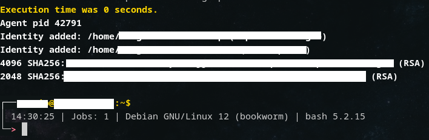
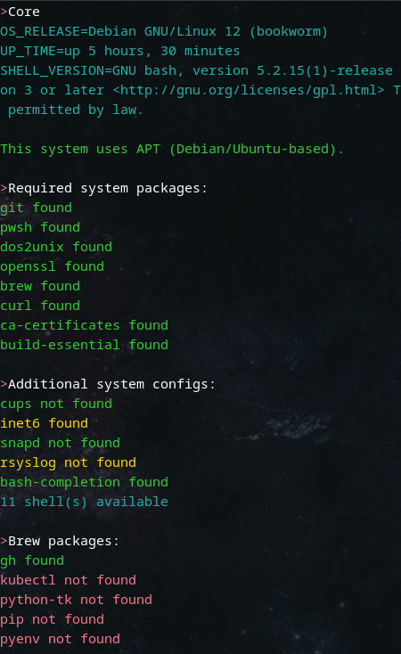

# myshell

## Purpose

Tool for bash shell behavior and powershell
Two main sections:
- Core: Files for managing shell profile
- Modules: Section for tools

## Requirements

Custom bash environment.
Mainly tested on apt systems and master branch/bash 5.2+.

## How to use

Bash:

1. Backup your ~/.bash_profile
2. Place file core/shells/bash/.bash_profile at $HOME
3. Modify "project_path" and set absolute path to the project
4. Re/Load shell
5. Run "checks" to list compatibility and "myshell" to get the available commands to use

Powershell:

Once done the bash configuration, if you have "pwsh" installed, automatically will set the $PROFILE for powershell - $HOME/.config/powershell/Microsoft.PowerShell_profile.ps1 

If you want to use this profile from Windows:

1. Install WSL2 distro 
2. Edit $PROFILE (ex: code $PROFILE, from a powershell terminal) with content from content core/shells/pwsh/Microsoft.PowerShell_profile.ps1

Remember to set the value for section "VARIABLE DECLARATION":
 - $global:distro=xxx
 - $global:project_path=xxx (relative path from $HOME)

bash

## Some project details:

- shell variable session
- some scripts create random files on /tmp (this random files are removed after the script is done)
- .gitattributes to control LF/CRLF format
- jobs loaded to track public ip change and user shell init
- main functions loaded for other scripts and user shell:
    · colors: possibility to user colors
    · crlf_to_lf: convert all files from current path and recursive except files like .ps1, .psm1, binaries ... 
    · genera_password: create random strings based on a criteria 
    · script_path: gets the "$0" value for running script

Core files:
core/session (called if exists on .bashrc/zshrc file)
    .var - To create variables for sensitive data like domains into scripts. Added in .gitignore.
    .aliases - Enable aliases.

used tools

